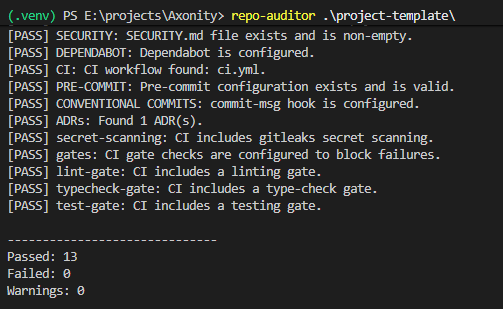
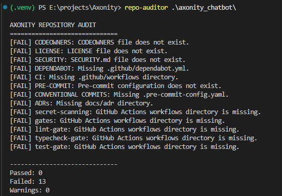
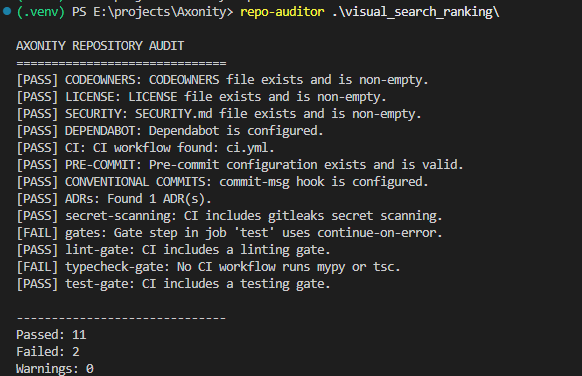
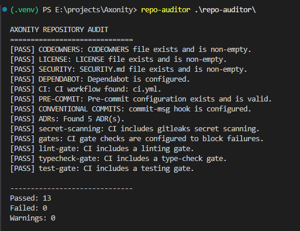

# ADR 0004: Decision to update CI gate process detection

**Status:** Proposed

**Date:** 2026-09-09

## Context

The Week 0 repository audit requires CI gates for processes such as linting and testing, while allowing equivalent tooling.

The original lint and test gate checks relied on specific tool names such as Ruff and pytest. This could incorrectly fail repositories that used an equivalent tool or process. The checks also risked false positives when words such as `test` or `lint` appeared in job names, step names, shell output, or package installation commands without actually executing the required process.

The `gates.py` check also relied on a hardcoded list of recognized commands. This could cause the gate check to miss valid CI processes and incorrectly report a repository as passing when a recognized gate process used `continue-on-error: true`.

The auditor therefore needed a shared approach that focused on the process being executed in GitHub Actions rather than requiring one specific library or package.

## Decision

We will use a shared process-based detection helper in `_process_gate.py` for lint, test, and CI gate checks.

The helper inspects executable commands from GitHub Actions `run` steps and recognizes common patterns for testing and linting, including direct tools, package scripts, Make targets, Python modules, and project scripts. Job names and step names will not be treated as evidence that a process is being executed.

The `gates.py` check will use the same helper to identify recognized CI gate processes and verify that those processes are configured as blocking gates. This ensures that `continue-on-error: true` is detected for supported processes even when the specific tool was not included in the previous hardcoded command list.

Updated repo-auditor running against the other repositories.

- project-template

- axonity_chatbot

- visual_search_ranking

- repo-auditor

## Alternatives considered

- **Hardcoded tool detection** — rejected because it requires specific tools such as Ruff or pytest and can incorrectly fail repositories that use equivalent tooling.

- **Keyword-based detection** — rejected because searching for words such as `test` or `lint` can produce false positives from job names, step names, shell output, documentation, or installation commands.

- **Runtime CI result detection** — rejected because the Week 0 gate check is intended to determine whether the required CI process is configured. Verifying whether the process actually succeeds would require executing or querying the CI system and is outside the scope of this check.

## Consequences

The lint, test, and CI gate checks can now support a broader range of legitimate repository configurations without requiring a specific tool.

The shared helper also reduces duplicated detection logic between the lint, test, and CI gate checks and makes false-positive behavior easier to test.

Applying the shared process-based detection to `gates.py` also prevents CI gates from being incorrectly reported as passing when a recognized gate process uses `continue-on-error: true`.

The approach remains heuristic. It cannot reliably determine the purpose of every arbitrary shell command, so additional process patterns may need to be added as new repository configurations are encountered.

The checks also verify that a process is configured in the workflow, not that the process successfully completes at runtime.
